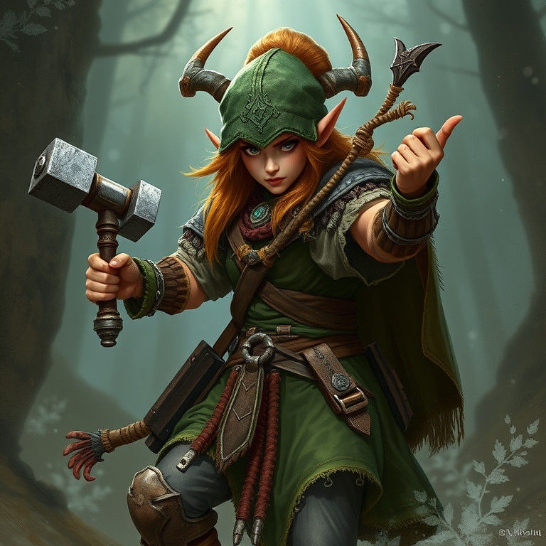
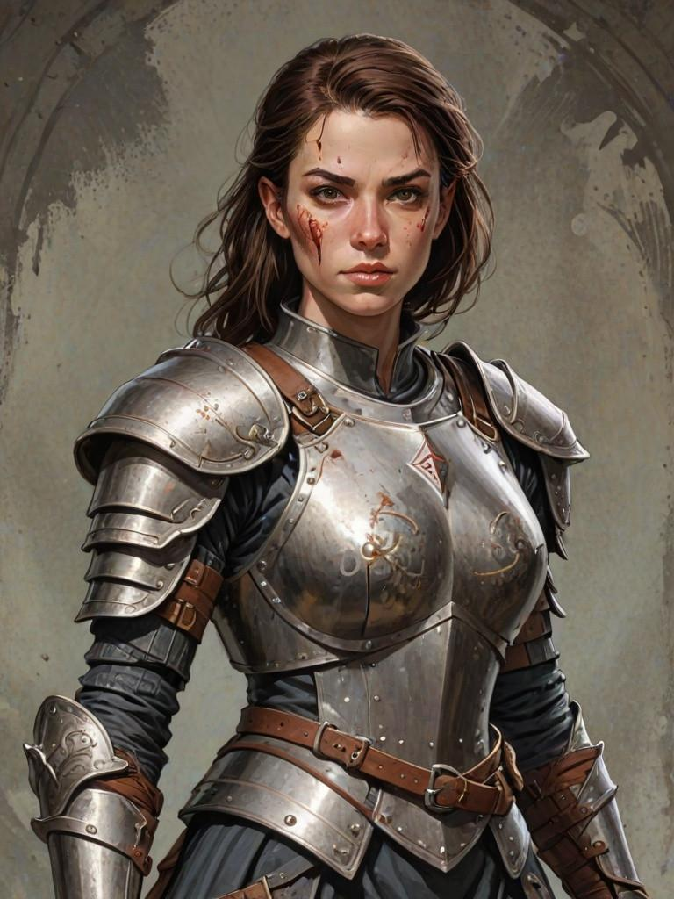

# BaldursGateEE

Welcome to this wiki page.

On this page you will find cheese cheats to play Baldur's Gate 1 & 2. Based on the exploits listed on the fandom site baldur's gate.

When playing the game Baldur's Gate, the game is terribly difficult even on easy difficulty. However, there are countless exploits that make this game very accessible.

Playing without cheese is simply impossible, a beginner will use the fog of war, the no cheater the garden of Mutanin. The only viable solution is to play with cheeses.

On this page, you will have the best builds with scripts based on the accessible cheats of the game. This page is not made for no cheaters, after all we will never be able to compete in cheating the garden of mutanin and the cape of Algernon.

Some cheeses are much nicer by modifying the game files to be made with the Near Infinity engine. On this github project, you will have access to the modified files.

A current habit of game development is to leave out the 2 biggest cheats of the game but to close/fix the more fun and lesser known cheats of the game. It's a terrible clumsiness but it's a fact. It inherently decreases the quality of the game, we can't really remove the Mutanin gardens so we can't really remove the other cheeses. These clumsiness force a little more to use Near Infinity to overcome these flaws.

## Win with certain cheeses

## Make old cheeses delicious again

## Make it easier with certain cheeses

## Conclusion

## Simplify the game with certain builds

The best feats in the game are those accessible with the sorcerer class. Adding the fact that the mage has the best spells to protect himself against weapons (stone skin and mirror image), against the elements (protection against fire, cold, electricity and acid), against spells (minor globe of invulnerability, immunity, spell deflection, spell turning, spell trap). Adding the fact that he also has access to the wand from level 1 and in particular to the fire wand which will make any fight easy with the fog of war feat. The mage allows you to play the game solo or with companions from normal difficulty to Bhaal's legacy. So the first character to create if you only want to play one game of Baldur's Gate is the wild mage, the multiclass mage or the sorcerer.

In multiclass with the mage, you have 3 choices. The first with the thief, for an obvious reason it is the swashbuckler who wins the bet however in dual class bounty hunter then mage is very appreciable offering you the luxury of the best archer of all Baldur's Gate EE. The second choice with the warrior, here the one who wins hands down is the Barbarian but in dual class without near infinity you can make a Berserker mage. The last choice with the priest, the Priest of Lathander is an excellent choice because it protects you from the level drain, very good saving throws and also reaches 10 attacks per round.

## Go further with other builds

However, it is also possible to finish the game on hard with 2 other interesting builds.

The cleric archer is the best divine spell caster. He can use two throwing weapons which are the sling and the hammer. Even if the priest would not have had access to the spear, it is curious to see that the spear is not throwable in Baldur's Gate. The archer will reach the city without difficulty, he will nevertheless need a companion to finish the adventure.

The [swashbuckler fighter](./fighter-thief/SWASHBUCKLER-WARRIOR.md) is the best warrior. His stealth attack, his traps, his armor class and his thaco better than a warrior will allow him to do the Baldur's Gate adventure without help. His thief skills like his stealth, his lockpicking and his pickpocketing will be very appreciable.

The totemic druid is not really fun to play (even if he can be a warrior too). The adventure is not complete solo at the end of the game against the 6 doppelgangers. Of course the creatures to summon are funny but will almost never touch their opponents (legacy of bhaal) making a very long game to finish.

The other classes and/or kits are generally worse.