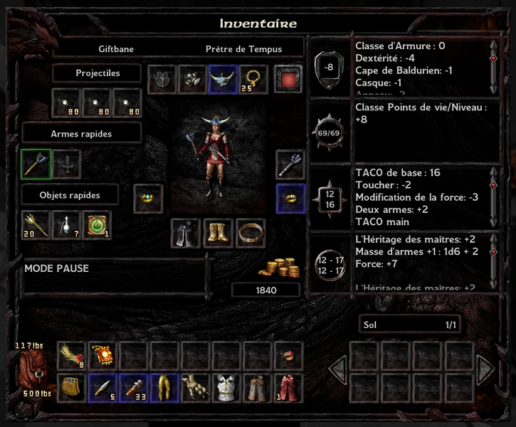

# BaldursGateEE

Even if Priest of Lathander is a good character, in Baldur's Gate 2, this character is too week to progress easily in the game. This reason comes from his innate ability and divine spell with casting time too low. Despite, one priest is very impressive, this is the priest of Tempus that have 2 very good innate ability with casting time of 1, indeed its innate ability scale with level.

To do a best Priest of Tempus, you need a dual class in Fighter or Ranger. Ranger add Iron skins for divine spell level 5 and Dolorous Decay for divine spell level 6, add Charm animal in innate ability is certainly the best spell gained when dualing. Beware, that you can only reach between 24 to 27 level to dual class in ranger. When you dual class, the 6 stars of proficiency must be exactly recover the proficiency already taken by your Priest competency. Level 25 is pretty cool because you gain the pretty Symbol of Tempus. With his innate ability Holy power, its symbol and Draw Upon Holy Might spell, the Tempus/Ranger will have contantly 25 in strength and 25 in dexterity.

## Baldur's Gate 1

Priest of Tempus can do the journey in heroic difficulty but it is very more difficult than the Swashbuckler fighter or the wild mage. To do that, you need The Stupefier that you can find in start of the game in a locked chest on the second floor of The Burning Wizard in Beregost. And you need Relair's Mistake, like that you reach 3 APR. Wand of the Heavens shall simplify combat equally.

The most difficult battle is the fight with doppelgangers but with the Relair's Mistake and the Stupefier, in heroic difficulty, the fight can succeed.

After that, in Baldur's Gate 2, all becommes very more easy!

## Baldur's Gate 2

Priest of Tempus can do easily the journey in heroic difficulty in Baldur's Gate 2. Even If it cannot be strong than Swashbuckler/fighter or the Wildmage, it can defeat easily all enemy. Priest of Tempus has few spell, but spell add an humoristic battle like Command spell.

To do an excellent Priest of Tempus character, you need use exploit in the game. The first is to buy Limited wish and Tempus get Greater Wolfwere innate ability. In wild magic zone, or with Neera, do the same to get Mustard Jelly innate ability with Polymorph self.

After that reach the level 25 and attack the Watcher keep. 

