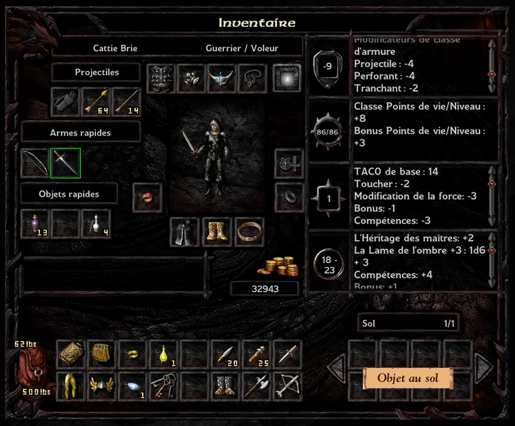
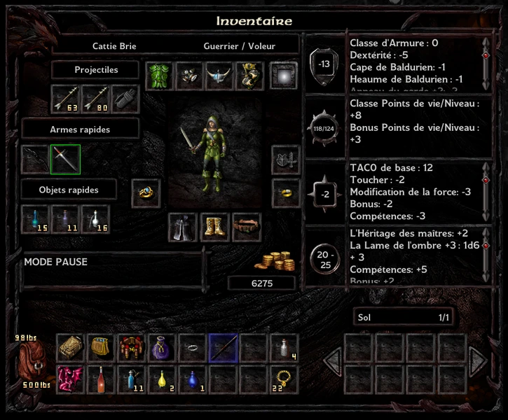
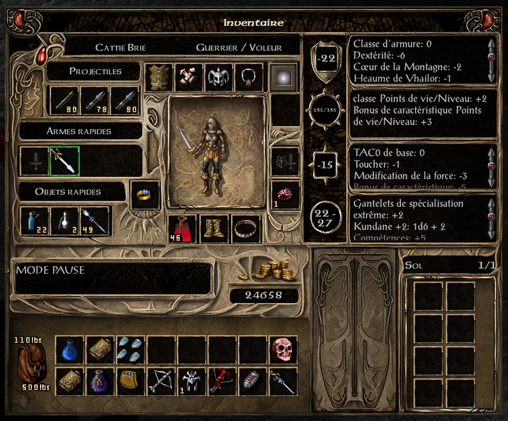
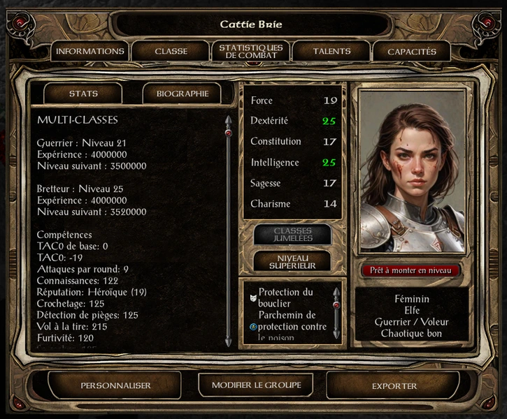

# BaldursGateEE

The swashbuckler fighter is the best fighter in Baldur's Gate 1 & 2. You need to create K_FT_E file, to add kit in multiclass via Near Infinity engine. K is for Kit, FT for fighter thief and E for Elf. If you wish create an another multiclass, check If the multiclass is enable and kit is enable for the specific race via CLSRCREG (all this file is 2DA).

## Advantage

+1 bonus to armor class at the start and +1 bonus every five levels (+6 AC bonus at level 25/28).
+1 bonus to-hit and damage every five levels (+5 at level 25/28).
Weapon specialization can be update via WEAPPROF file 2DA folder (else use no cheater mode and do a Berserk dual class Mage and get out)
Backstab like a thief and better than a stalker.

From this advantage, the swashbuckler fighter has a great thaco, a great ac (even the best AC in the game), a great damage. Can kill in one time an enemy or can trap adversary (stalker cannot).

## Choose the weapon

After played Baldur's Gate I,SoD,II Enhanched Edition. For the Fighter/Thief build (that is very very good), the best weapon with 12 stars at the end of WK5, is clearly Scimitar (for is Ninjato of the Scarlet Brotherhood +3), and Crossbow (for is The Army Scythe +1 APR and Firetooth +4, lots Bolts of Biting, Bolts of Lightning and Kuo-Toa Bolts), so choose Scimitar, Single Weapon Style (+1 AC), Crossbow and Two-hand weapon style (+1 Damage).

As lich is immune to spell weapon +0/+1/+2/+3. We need in early Baldur's Gate 2 a weapon that can hit a lich (with the golem, its the only creature that need really fighter to kill it easily). In Baldur's Gate 2 EE, that is few weapon that can hit in the start a lich (finally it is simple to know what weapon must be selected for the fighter thief.

|Weapon|Special|Location|
|:-|:-|:-
|Foebane +3|+6 damage vs. undead, shapeshifters, demons and devils|WK Level 1|
|Daystar +2|+4 vs. evil creatures, Double damage vs. undead, 1/day: Sunray|City Gates|
|Staff +4| |Ribald|
|Staff of the Magi +5|AC -2 SAVES -2 Invisibility Immune to charm Protection From Evil Dispel Magic (level 30) on hit 3/day: Fireball-Lightning Bolt 1/day: Spell Trap|Layenne|
|Usuno's Blade +4|10% chance of +2-20 electrical damage (save vs. spell for half)|WK Level 1|
|Short Sword of Mask +4| 15% chance per hit that target is entangled for 4 rounds|Sister Garlena|

Once this list has been done, we notice that there is only three weapon with backstab: Long sword (1/8), Scimitar (1/8), Short sword (1/6), Quaterstaff (1/6) that can hit easily in start of Baldur's Gate a lich. Despite Katana (1/10) can be choosen with Fury Celest a very good weapon, the Fighter thief can not kill in the start of the game the lich.

Elf has one bonus to hit with long sword and short sword.
Single weapon style add -1/-2 bonus to armor class. 

In Baldur's Gate 1, with a short sword in one hit, you can already reach 100 damage. But Scimitar is clearly better, Ninjato can hit Mage with his poison and the more dangerous is clearly the Mage. Indeed, its easy to get Twinkle that gift the best bonus AC (AC -2), its very easy to get Belm +2 (no fighting, just loot a chess without trap). With Twinkle +3, and The Warder's Signet +3, it missed only 4 AC to reach the minimum AC, with White Dragon Scale, it missed only 2 AC.

## Reach the best Armor class

As said in the wiki of Baldur's Gate, there is three AC. You can reach -20 AC in general AC, -8 AC in uncapped general AC (dexterity and single weapon style), situationnal AC (improved invisibility and protection from evil), type AC.

With the swashbuclker, it's more easy to reach -20 with his -6 bonus.

|General AC|
|:-

|Position|Item|Opcode|Bonus AC|Other Bonus|
|:-|:-|:-|:-|:-
|Armor|Potion of defense||-10||
||White Dragon Scales|COMPON18||Components|WK3|
||White Dragon Scale|CHAN20|-12|Cespenar (ToB)|
|Necklace|Heart of the mountain||-2||
||Amulet of the master harper||-3|(ToB)|
|Cloak|Cloak of the Shield|CLCK20|0|Type AC Bonus|
||Cloak of the Sewer||-1|Polymorph|
||Montolio's Cloak||-1|(ToB)|
||Cloak of the Dark Moon||-2|(ToB)|
|Bracers|Bracers of Defense|BRAC15|-7|Armor|
||Gauntlets of Extraordinary Specialization||THACO -1 APR +1/2 DAMAGE +2 (WK5)|
||Gauntlets of Weapon Expertise||Where ?! Too late... Too bad...|
||Wondrous Gloves||-1||
|Helmets|Vhailor's Helm|WA2HELM|-1|Simulacrum|
||Helm of Balduran||-1|SAVES -1 HP +5|
||Helm of Brillance|HELM16|0|Sunray Casting Time 0|
||Headband of the Devout|OHRHELM1|0|Chant (ToB)|
|Rings|Ring of Gaxx||-2|SAVES -2 RESIST POISON 100% 1HP/3SEC|
||The Guard's Ring||-2|SAVES -2|
||The Warder's Signet||-3|SAVES -3|
|Weapon|Twinkle +3 (Scimitar)||-2|Enchantment +5|
||Axe of the Unyielding +3||-1|Flail|
||Defender of Easthaven +3||-1|Better for Ranger/Barbarian|
||Dak'kon's Zerth Blade +2||-1|Katana|
||Yamato +4 (Scimitar)||-1|(ToB) Too late!|
|Innate ability|Swashbuckler (-1 to -9)||-6|Passive (level 25)|
||Greater evasion (-6)||MAX|5 rounds (SAVES -12 SPEED +12)|
||Evasion (-4)||MAX|3 rounds (SAVES -8)|
||Kensei||-2|Passive|
|Scroll|Blur|SCRL85|-3|10 rounds (SAVES -1)|

The Swashbuclker/Fighter can reach easily with General AC and Uncapped General AC, it's pretty easy to reach between -18 to -20. It's more difficult to reach the -28 because you need specific items to buy or active ability. Indeed, with Cloak of the Shield, and in a fightning, you can easily in-grow your global situational AC by 6 for crushing, slashing and piercing AC and reach to -20 AC for projectil.
Neverthless, the Swashbuckler can reach maximum general AC by one spell with Blur, Evasion and/or Greater Evasion. Greater Evasion is very funny to see! The Swashbuckler/Fighter is a very good build!
Don't forget that to get Twinkle and/or The Warder's Signet, you must done an act that is not very ethical.

|Uncapped bonus AC|
|:-

|Dexterity|Bonus Ranged THACO|Bonus AC|Note|
|:-|:-|:-|:-
|16|-1|-2||
|17|-2|-3||
|18||-4||
|19|-3||Book or Elves|
|20|||Machine, Book and/or Elves|
|21|-4|-5|Machine, Book and Elves|
|25|-5|-6|Potion of Mind Focusing (POTN37)|
|Single Weapon Style|Critical hit chance|Bonus AC||
|1 (one star)| Critical on 19 or 20|-1||
|2 (two stars)| " |-2||

Because a Thief, as a very good stat in detxerity between 17 and 19 in BG1 and several times 25 in BG2. Indeed bonus damage and thaco for the Swashbuckler, the Swashbuckler is a very very good Archer. take Crossbow for a build with Fighter, take (Short) Longbow for a build with Mage. 

|Type AC|
|:-

|Opcode|Situational AC|Missile AC|None-missile AC|Note|
|:-|:-|:-|:-|:-
||Studded Leather Armor||PIERCING -1 SLASHING -2|
||Elves' Bane|-3|PIERCING -3|Early in BG1 and BG1|
||Cloak of the Shield|MAX -20|-6|50 Charge, 1 turn|

|Situational AC|Bonus AC|Bonus Saves|Advice/Condition|
|:-|:-|:-|:-
|Invisibility status|-4|-4|Hide, Shadow door, (Improved) Invisibility|
|Protection from Evil|-2|-2|Enemy with Evil alignment|
|Ranged weapon|+4||Malus|
|Blinded|+4|+4|Blinded is in fact a bonus, with Snare exploit|	    

## Items Baldur's Gate 1

|Position|Item|Opcode|Bonus AC|Bonus Saves|Other Bonus|In-game|
|:-|:-|:-|:-|:-|:-|:-
|Helmet|Helm of Balduran|HELM07|-1|-1|THACO +1 HitPoint +5|TRUE|
||Helm of the Noble|HELM03|-1||CHA +1|TRUE|
|Armour|Studded Leather Armor|LEAT04|SLASHING-2 PIERCING-1 MISSILE-1||Not magical|TRUE|
||Shadow Armor +3|LEAT08|SLASHING-2 PIERCING-1 MISSILE-1||Hide in shadow +15%|TRUE|
|Gauntlet|Legacy of the Masters|BRAC10|||THACO +1 DAMAGE +2|TRUE|
|Ring|The Guard's Ring +2|RING07|-2|-2||TRUE|
||Batalista's Passport|RING02|||FIRE+40%|TRUE|
||The Claw of Kazgaroth|MISC72|-1 MISSILE-4|DEATH+4 4oTHERS-3|CON -2|TRUE|
|Amulet|The One Gift Lost|AMUL01|||Fireball(Level ?) Max 25 Charges|TRUE|
|Belt|Elves' Bane|BELT04|PIERCING-3 MISSILE-3|||TRUE|
|Boots|The Paws of the Cheetah|BOOT01|||Double movement cheetah|TRUE|
||Worn Whispers|BOOT02|||Move Silently +20% Hide in shadow +15%|TRUE|
|Weapon|The Dead Shot +2|BOW07|||Longbow THACO +3 DAMAGE +2|TRUE|
||Throwing Axe +2|AX1H05|||Return in hand when throwned|TRUE|
||Dart of Stunning|DART03|||Save vs. spell or be stunned for seven rounds.|TRUE|
||Dart of Wounding|DART04|||Save vs. Death or 1 poison damage/s for 20s.|TRUE|
||The Army Scythe +1|XBOW06|||Light Crossbow APR +1|TRUE|
||The Shadow's Blade +3|SW1H10|||Speed Factor 0|TRUE|
||Twinkle +3|SW1H15|-2||Enchantment +5|Cond|
||Icingdeath +3|SW1H14|||FIRE +50%|Cond|
|Cond|Drizzt Do Urden|DRIZZT|||Kill Very Easy with Swashbuckler|TRUE|
||Rashad's Talon +2|SW1H23|||Enchantment +2|TRUE|
||The Whistling Sword +2|SW1H09|||Enchantment +2|TRUE|
||Short Sword +1|SW1H08|||Enchantment +1|TRUE|
||Viper's Edge +2|SW1P01|||Enchantment +2 APR +1 Add 50% backstab damage Petrified (on equip, on load, and on hit), Poisonned (on hit), CON -1 (permanent, on equip and on load)||
|Cloak|Cloak of Balduran|CLCK05|-1|-1|MAGIC+25%|TRUE|
||Cloack of Displacement|CLCK03|MISSILE-4|DEATH-2 BREATH-2 WAND-2|Blur|TRUE|
|State|Blur|SPWI201|-3|-1|Blurred|TRUE|

Viper's Edge shall be an interesting weapon but the necessary immunity constantly to petrify impose Mage class, indeed the best bonus back impose thief. Two class can be choosed that is Fighter/Mage/Thief or Mage/Thief. Add the fact that the THACO of a Mage/Thief is bad, you should use exploit with dual class (to get THACO 0). Finally, Viper's Edge require equally that you are immune to poison, start only in Siege of Dragonspear and BGII. Has a +2 Enchantment, this weapon, in Baldur's Gate II replace perfectly Belm +2, Kundane +2 or Ninjatō of the Scarlet Brotherhood +3. A thief/mage can get easily 7 APR, 0 THACO, Grand Master Long sword THACO -3 DAMAGE +5 and SPEEDFACTOR -3 (only with few exploits).
Viper's Edge is an evil easter egg, lose your time with this poo item. The only thing interesting that it can kill any companion (unless priest or mage) by petrified him or suffered a negative constitution.

## Items Siege of Dragonspear

As stated, the swashbuckler fighter is an extremely solid fighter and even without a ranged weapon specialization, he will take out a good number of opponents at range. It is very enjoyable to do the adventure without a strict choice on the ranged weapon. Depending on your ammo, choose the weapon you prefer. However, one ranged weapon that is particularly cool in Siege of Dragonspear is the Banshee Bow which is a longbow. Specializing in a longbow is therefore a good idea. Also, you do not need to reach level 9 weapon mastery in your sneak attack weapon (shortsword, scimitar or longsword) because you will only gain the extra half attack at level 13, except that you need its 2 half attacks to not conflict with the speed oils (80 when Imoen dies). However, in Baldur's Gate 2, shortbows seem to be better than longbows.

|Position|Item|Opcode|Bonus AC|Other Bonus|In-game|
|:-|:-|:-|:-|:-|:-
|Helmet|Vhailor's Helm|WA2HELM|-1|Simulacrum 1/day|TRUE|
||Helm of Brillance|HELM16||Sunray 1/day|TRUE|
|Armour|Studded Leather Armor|LEAT04|SLASHING-2 PIERCING-1 MISSILE-1||Not magical|TRUE|
|Gauntlets|Gauntlets of Extraordinary Specialization|BRAC21|APR +1/2 THACO -1 DAMAGE +2|
|Ring|The Warder's Signet +3|RING41|-3|SAVES -3|Aesgareth|
|Ring|Ring of Gaxx|RING39|-2|SAVES -2 POISON 100% +1HP/3sec|TRUE|
|Amulet|Heart of the Mountain|BDAMUL26|-2||TRUE|
|Belt|Elve's Bane|BELT04|MISSILE/PIERCING -3||TRUE|
|Boots|The Paws of the Cheetah|BOOT01||Double movement speed|TRUE|
|Weapon|The Army Scythe +1|XBOW06||+1 APR|TRUE|
||Kundane +2|SW1H25||+1 APR|TRUE|
||Ras the Dancing Blade +2|SW1H33C||EARN GOLD|TRUE|
||Daystar +2|SW1H31||Sunray 1/day|TRUE|
||Twinkle +3|SW1H16|-2|Enchantment +5|TRUE|
||Ninjato of the Scarlet Brother +3|WANINJA||+1 APR 12 Poison/12sec (saves death negate) Bypass MR and MI|TRUE|
||Firetooth +4|XBOW15||Enchantment +4|TRUE|
||Bolt of Lightning|BOLT03||4d4 (saves breath half)|
||Bolt of Biting|BOLT04||30 poison/15 second (saves death negate)|
||Kuo-Toa Bolt|KUOBOLT||STUN (saves spell negate)|TRUE|
||Wand of Lightning|WAND07||CHEESE|TRUE|
|Compon|White Dragon Scales|COMPON18|||TRUE|

Heart of the Mountain is in Baldur's Gate II even If you haven't search this item in Siege of Dragonspear. Its the best Necklace for the Swashbuckler.

## Items Baldur's Gate 2

With a solid fighter, starting Baldur's Gate II is easy. In the beginning, you need the Ring of Influence that you can find in the circus queston the promenade. When you start Chapter 2, buy Mastery Thieves potion, and start the game with Roger in the Sewer under Temple district. Reach 15 000 gold or more, and buy the Mercykiller ring, steal from Ribald ring of regeneration, steal the Army scithe and Bolt of lightning (4d4 electric damage half saves vs Breath), Sword of flame (useful against Troll). The best range weapon is so Light crossbow (Bolt of biter, there is a lot in BG2), then Shortbow (Bow of explosion) and finally Sling (Sling of Seeking add strength bonus for damage).

## Use Any Item

Use any item is a strong high ability for the thieves, but on the web. It's very difficult why this ability is strong. Indeed Rogue misses an ability like this.
A special page will be writed to relate the best way to play with this ability.

## Vhailor's Helm

Thief can do a simulacrum with Vhailor's Helm. Also a special page, will be created to speak about synergy with this great spell.

## Algorithm
