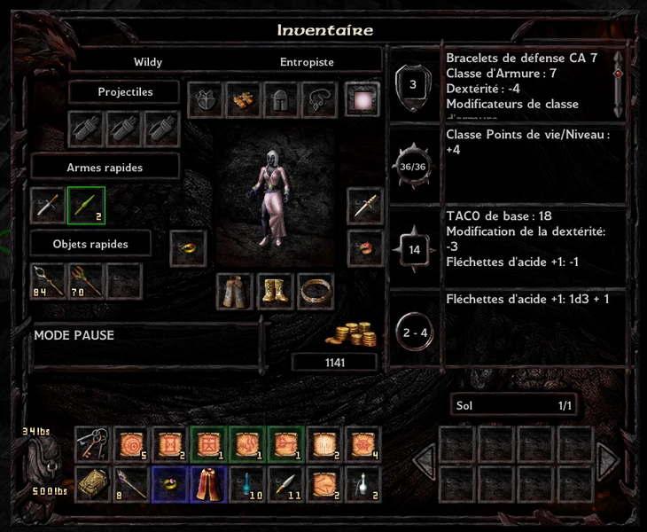

# BaldursGateEE

The mage is the best class in Baldur's Gate 1 & 2. It's the only class can do the game in Legacy of Bhaal difficulty. You doesn't need other companion to do Baldur's Gate 1, Siege of Dragonspear and Baldur's Gate 2 (of course ToB include). The mage has access to very powerful wand in Baldur's Gate 1 and it can restore easily his spell in middle game of Baldur's Gate 2. Indeed arcanic spell give all possibility to win. Indeed Mage reach 3 APR without rolling thaco in Baldur's Gate 1 and 10 APR in Baldur's Gate 2.

## Wild Mage advantage

Previously WildMage can dual class in the Baldur's Gate opus, it quite simple to reabilate it, add one line WILDMAGE in DUALCLASS.2da and copy data from any specialist mage. Wild Mage even If BLUE spell is really not a good idea to launch can do the game in Baldur's Gate 1 because you only need wand in the opus and few spell in the end (6 doppelganger, maybe Sarevok).
But Wild Mage is strong for many reasons,

[x] Even more easy to recover spell via Nahal's Reckless Dweomer and Limited Wish and/or Wish.
[x] Convert between 1 or 2 spell level 1 by a stronger spell (Disintegrate, Dragon Breath, Black Blade of Disaster, etc).
[x] After a normal spell, continue with Nahal's Reckless Dweomer to launch another spell.
[x] Via Nahal's Reckless Dweomer, choose the right spell without memorize it.
[x] Cheese of Nahal, With 2 Nahal's Reckless Dweomer, convert your mage by an infinite caster without wild surge.

But even without the last cheese, the mage is the lonely hero that can do the entire opus in Legacy of Bhaal difficulty. In Baldur's Gate 1, the most powerful mage is Xan because it has the best kit in start of the sage. Nevertheless, without Use Any Item and so a dualclass in thief or a multiclass in thief, the enchanter become less powerful in Baldur's Gate 2 for one reason, it cannot learn any sequencer spell.

So, any player can do Baldur's Gate 1 in Legacy of Bhaal even an hero without a class. The last thing it must be done is to recruit Xan, use the Wand and finish the game.

## Choose the equipment

To defeat enemy without the last cheese, you need strike (and very often) with your weapon. To do that, you need: Relair's Mistake (CLCK04), in shield a Dagger (buy after replenish wand): Dagger of Venom +2 (MISC75), Wand of Paralyzation (WAND04), Wand of Monster Summoning (WAND10), Scroll Chaos (SCRL5P), Scroll Polymorph Selph (SCRL5M).

Paralyze your opponent or put in an helpless state, and strike with 3 APR.

## Items Baldur's Gate 1

|Position|Item|Opcode|Bonus AC|Bonus Saves|Other Bonus|In-game|
|:-|:-|:-|:-|:-|:-|:-
|Helmet|None||||||
|Armour|None||||||
|Gauntlet|Bracers of Defense AC 7|BRAC02|-3|||TRUE|
|Ring|Evermemory|RING08|||Double spell level 1|TRUE|
||Batalista's Passport|RING02|||FIRE+40%|TRUE|
|Amulet|None|||||TRUE|
|Belt|Elves' Bane|BELT04|PIERCING-3 MISSILE-3|||TRUE|
|Boots|The Paws of the Cheetah|BOOT01|||Double movement cheetah|TRUE|
|Weapon|Heart of the Golem +2|DAGG03||||TRUE|
||Dart of Acid +1|AX1H05DART11||||TRUE|
||Dart of Stunning|DART03|||Save vs. spell or be stunned for seven rounds.|TRUE|
||Dart of Wounding|DART04|||Save vs. Death or 1 poison damage/s for 20s.|TRUE|
|Cloak|Cloak of BalduranRelair's Mistake|CLCK04|||Add 2 APR, 1d8 PIERCING damage|TRUE|
|Quick|Wand of Paralyzation|WAND04|||Hold target -4 saves vs Wand (ENCHANTER) 1 turn|TRUE|
||Wand of Monster Summoning|WAND10|||Summon 12HD many monster 2 turn|TRUE|
||Chaos|SCRL5P|||Confuse area target -4 saves vs Spell (ENCHANTER) min 5 rounds|TRUE|
||Polymorph Self|SCRL5M|||Immune to magic and dispell magic min 2 turns|TRUE|
||Slow|SPWI312|||Slow area target -3 saves vs Spell (TRANSMUTER) 1 turn, Slowed creature suffer 4 penality in future saves|TRUE|
||Glitterdust|SPWI224|||Blind area target saves vs Spell (CONJURER) 4 round|TRUE|
||Emotion: Hopelessness|SPWI411|||Sleep area target saves vs Spell (ENCHANTER) 1 turn|TRUE|
||Greater Malison|SPWI412|||Suffer +4 saves Area target min 1 turn|TRUE|
|State|Blinded,Slowed||||Suffer +4AC and +4 saves|TRUE|

